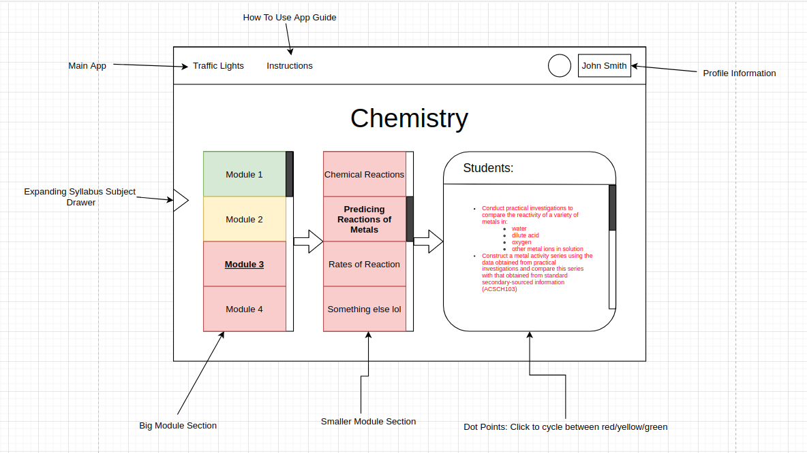

# Traffic Lights App for Pathfinder

This app consists of 2 components:

- A script for parsing HSC syllabus files into CSV format, and
- A graphical web application for visualising and tracking traffic lights

## Scripting

The script accepts a syllabus file in text format (.txt) and parses said text file.

### Planned Steps:

- Copy Syllabus file into .txt document with some manual formatting
- Convert Syllabus into CSV file
- Read CSV file and convert into JSON for web application consumption

### Format of CSV

Chemistry syllabus used as first test.

1. Big Modules Content _(e.g: Module 3: Reactive Chemistry)_
2. Smaller Topic _(e.g: Predicting Reactions of Metals)_
3.

## Web Application

Building in process - more to come.

[Full Current Concept (Click me!)](https://drive.google.com/file/d/1Qg6NkmXbJBD62tex6Ju0b7NDtOok31_g/view?usp=sharing)
